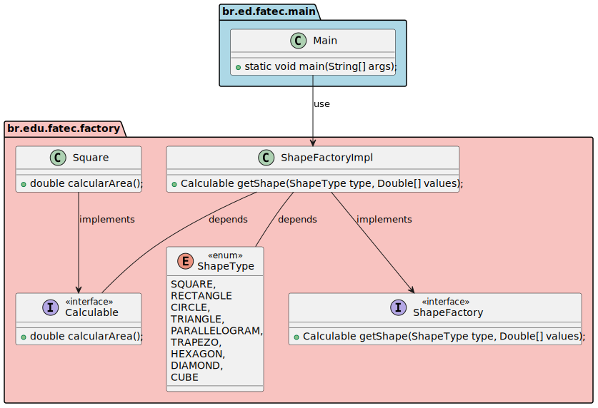

# AreaChecker

Projeto desenvolvido como exercício de fixação para a disciplina de **Linguagem de Programação II**, com o objetivo de criar uma aplicação Java que auxilie na conferência de cálculos de área de diversas figuras geométricas.

## Descrição

Um professor de faculdade solicitou o desenvolvimento de uma aplicação simples que calcule a área de várias figuras geométricas básicas, de forma organizada, utilizando uma estrutura de pacotes bem definida, interfaces, enums e aplicação do conceito de **fábrica de objetos**.

O acesso centralizado à criação dos objetos geométricos é feito por meio da classe `ShapeFactoryImpl`, garantindo encapsulamento e uma única porta de entrada para as operações de cálculo.

O projeto também inclui uma classe de testes (`Main.java`), que executa ao menos um cenário de teste para cada figura geométrica implementada.

---

## Figuras Geométricas Suportadas

- Quadrado
- Retângulo
- Círculo
- Triângulo
- Paralelograma
- Trapézio
- Hexágono
- Losango
- Cubo

---

## Estrutura do Projeto

- **Pacote `br.edu.fatec.factory`**
  - Interface `Calculable` (define o método `calcularArea()`)
  - Interface `ShapeFactory` (define o método de criação de formas)
  - Enum `ShapeType` (define os tipos de formas geométricas)
  - Classe `ShapeFactoryImpl` (fábrica de formas)
  - Classes das figuras geométricas, como `Square`, `Rectangle`, etc.

- **Pacote `br.ed.fatec.main`**
  - Classe `Main` (executa os cenários de teste)

---

## Diagrama de Classes

## Objetivos de Aprendizagem

- Estruturação e organização de pacotes
- Aplicação de boas práticas de codificação
- Implementação de interfaces e enums
- Uso de polimorfismo
- Padrão de projeto **Factory**
- Criação de cenários de teste simples

---

**Projeto desenvolvido para fins educacionais.**
